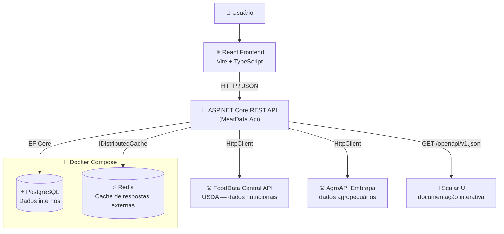
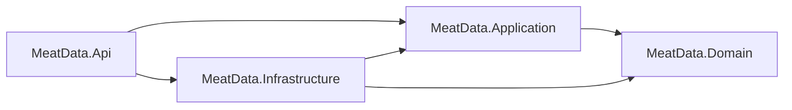
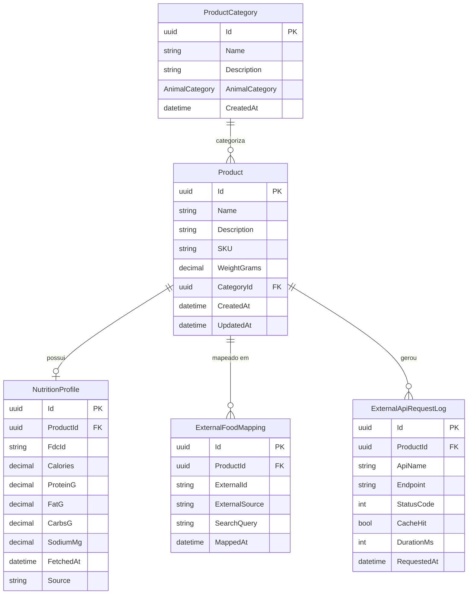
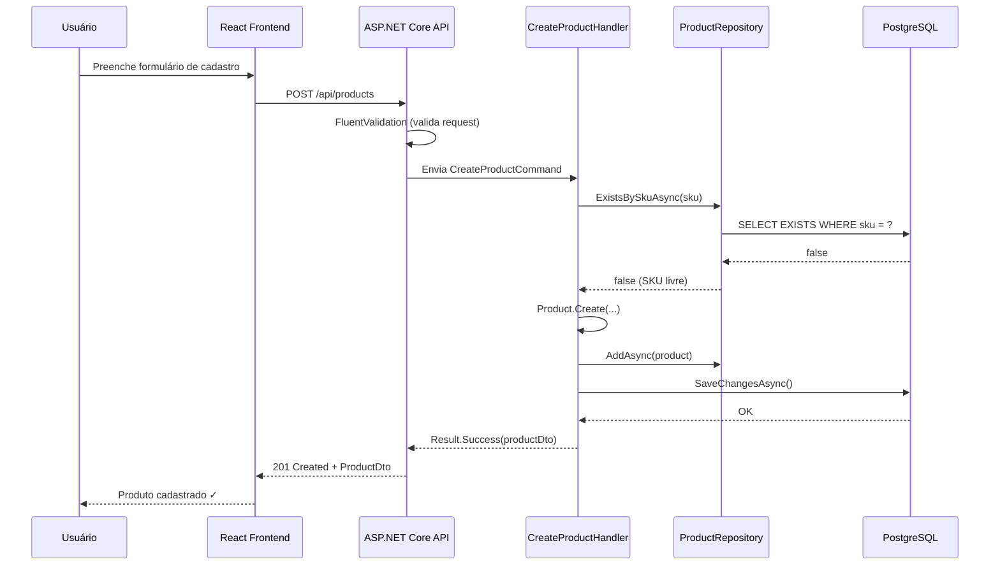
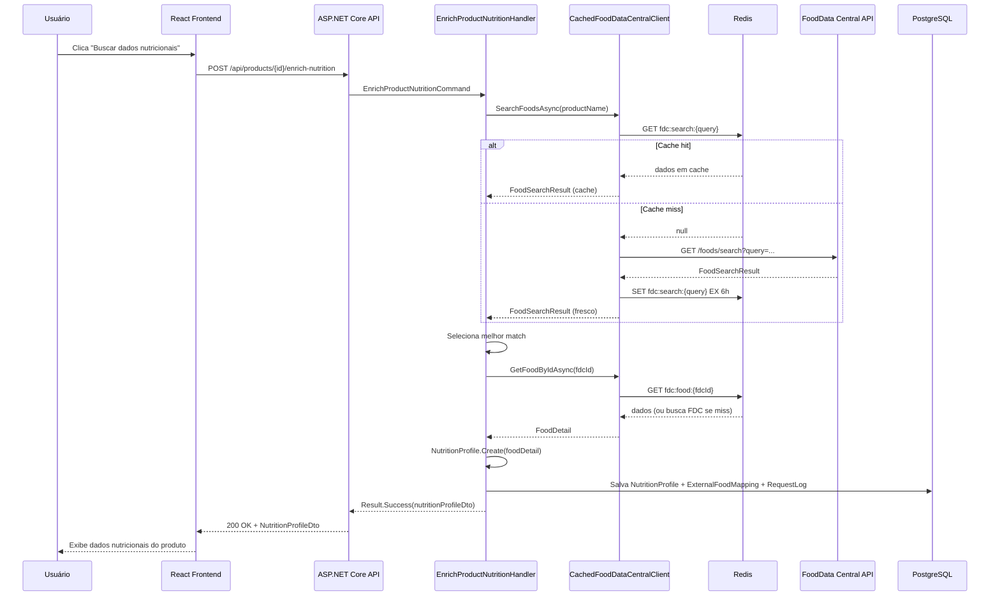
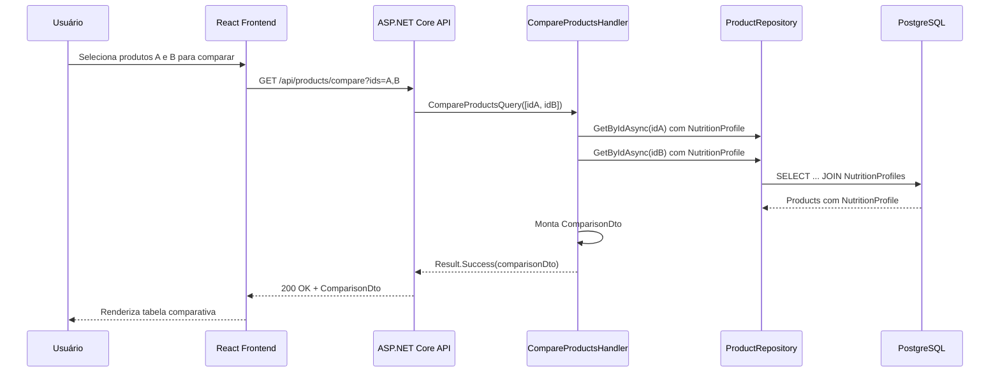

> *API REST com ASP.NET Core 9 + React + integração com FoodData Central e AgroAPI.**Projeto 1 de 4 do roadmap frigo-dotnet-labs.*

---

## Visão Geral

Aplicação fullstack para cadastrar, consultar e comparar cortes/produtos cárneos com enriquecimento nutricional automático via APIs públicas.

**O que esse projeto prova no portfólio:**

- API REST limpa em ASP.NET Core com Clean Architecture

- Integração com APIs públicas reais (FoodData Central + AgroAPI)

- Cache de resposta externa com Redis

- Frontend funcional em React com TypeScript

- Testes de integração com Testcontainers

- Containerização com Docker Compose

**O que esse projeto deliberadamente ignora** *(porque não é o foco aqui)*:

- Autenticação/autorização → entra no Projeto 3

- Mensageria → RabbitMQ chega no Projeto 3

- Service discovery e gateway → Projeto 2

- IA e MCP → Projeto 4

---

## Stack e Dependências

### Backend (.NET 9)

| Pacote NuGet                                      | Versão sugerida | Uso                                            |
| :------------------------------------------------ | :-------------- | :--------------------------------------------- |
| `Npgsql.EntityFrameworkCore.PostgreSQL`           | 9.x             | ORM + driver PostgreSQL                        |
| `Microsoft.EntityFrameworkCore.Tools`             | 9.x             | Migrations via CLI                             |
| `Microsoft.AspNetCore.OpenApi`                    | 9.x             | Geração do documento OpenAPI                   |
| `Scalar.AspNetCore`                               | latest          | UI interativa (substitui Swagger UI no .NET 9) |
| `Microsoft.Extensions.Caching.StackExchangeRedis` | 9.x             | Cache distribuído com Redis                    |
| `Microsoft.Extensions.Http.Resilience`            | 9.x             | Retry + circuit breaker para HttpClient        |
| `FluentValidation.AspNetCore`                     | 11.x            | Validação de DTOs/requests                     |
| `Serilog.AspNetCore`                              | 8.x             | Logging estruturado                            |

> **Nota:** `Microsoft.Extensions.Http.Resilience` é o substituto moderno do `Polly` para HttpClient no .NET 8+. Usa Polly internamente, mas com uma API muito mais limpa.

### Frontend (Node 20+)

| Dependência                  | Uso                               |
| :--------------------------- | :-------------------------------- |
| React 19 + Vite + TypeScript | Base da aplicação                 |
| TanStack Query               | Fetch, cache e estado de servidor |
| React Router v7              | Roteamento                        |
| Axios                        | HTTP client                       |
| Tailwind CSS                 | Estilização                       |
| shadcn/ui                    | Componentes                       |

### Infraestrutura local

| Serviço       | Imagem Docker        |
| :------------ | :------------------- |
| PostgreSQL 16 | `postgres:16-alpine` |
| Redis 7       | `redis:7-alpine`     |

---

## Arquitetura

### Clean Architecture em camadas

```text
┌─────────────────────────────────────────────────┐
│                   MeatData.Api                  │  ← Controllers, Middlewares, DI setup
│         (ASP.NET Core — entry point)            │
└──────────────────────┬──────────────────────────┘
                       │ referencia
┌──────────────────────▼──────────────────────────┐
│              MeatData.Application               │  ← Use cases, interfaces, DTOs, validators
│         (regras de aplicação — sem EF)          │
└──────────────────────┬──────────────────────────┘
                       │ referencia (só Domain)
┌──────────────────────▼──────────────────────────┐
│               MeatData.Domain                   │  ← Entities, enums, exceptions, value objects
│         (zero dependência externa)              │
└─────────────────────────────────────────────────┘
                       ▲
                       │ implementa interfaces de Application
┌─────────────────────────────────────────────────┐
│            MeatData.Infrastructure              │  ← EF Core, repositories, HTTP clients, cache
│         (detalhe de implementação)              │
└─────────────────────────────────────────────────┘
```

**Regra de ouro:** a seta de dependência aponta para dentro. Domain não conhece ninguém. Infrastructure conhece Application e Domain. Api conhece tudo (mas só para fazer wiring no DI).

### Diagrama do sistema completo



### Fluxo de dependências entre projetos C#



---

## Estrutura de Pastas

```text
01-meatdata-portal/
│
├── src/
│   ├── MeatData.Domain/
│   │   ├── Entities/
│   │   │   ├── Product.cs
│   │   │   ├── ProductCategory.cs
│   │   │   ├── NutritionProfile.cs
│   │   │   ├── ExternalFoodMapping.cs
│   │   │   └── ExternalApiRequestLog.cs
│   │   ├── Enums/
│   │   │   └── AnimalCategory.cs
│   │   ├── Exceptions/
│   │   │   ├── DomainException.cs
│   │   │   └── ProductNotFoundException.cs
│   │   └── MeatData.Domain.csproj
│   │
│   ├── MeatData.Application/
│   │   ├── Products/
│   │   │   ├── Commands/
│   │   │   │   ├── CreateProduct/
│   │   │   │   │   ├── CreateProductCommand.cs
│   │   │   │   │   ├── CreateProductHandler.cs
│   │   │   │   │   └── CreateProductValidator.cs
│   │   │   │   └── EnrichProductNutrition/
│   │   │   │       ├── EnrichProductNutritionCommand.cs
│   │   │   │       └── EnrichProductNutritionHandler.cs
│   │   │   ├── Queries/
│   │   │   │   ├── GetProductById/
│   │   │   │   ├── GetProducts/
│   │   │   │   └── CompareProducts/
│   │   │   └── DTOs/
│   │   │       ├── ProductDto.cs
│   │   │       ├── ProductSummaryDto.cs
│   │   │       └── NutritionProfileDto.cs
│   │   ├── Nutrition/
│   │   │   ├── Queries/
│   │   │   │   └── SearchFoods/
│   │   │   └── DTOs/
│   │   ├── Common/
│   │   │   └── Result.cs
│   │   ├── Interfaces/
│   │   │   ├── Repositories/
│   │   │   │   ├── IProductRepository.cs
│   │   │   │   ├── IProductCategoryRepository.cs
│   │   │   │   └── IExternalApiRequestLogRepository.cs
│   │   │   └── ExternalApis/
│   │   │       ├── IFoodDataCentralClient.cs
│   │   │       └── IAgroApiClient.cs
│   │   └── MeatData.Application.csproj
│   │
│   ├── MeatData.Infrastructure/
│   │   ├── Persistence/
│   │   │   ├── AppDbContext.cs
│   │   │   ├── Configurations/
│   │   │   │   ├── ProductConfiguration.cs
│   │   │   │   └── NutritionProfileConfiguration.cs
│   │   │   ├── Repositories/
│   │   │   │   ├── ProductRepository.cs
│   │   │   │   └── ExternalApiRequestLogRepository.cs
│   │   │   └── Migrations/
│   │   ├── ExternalApis/
│   │   │   ├── FoodDataCentral/
│   │   │   │   ├── FoodDataCentralClient.cs
│   │   │   │   ├── FoodDataCentralOptions.cs
│   │   │   │   └── Models/
│   │   │   │       ├── FoodSearchResponse.cs
│   │   │   │       └── FoodDetailResponse.cs
│   │   │   └── AgroApi/
│   │   │       ├── AgroApiClient.cs
│   │   │       ├── AgroApiOptions.cs
│   │   │       └── Models/
│   │   ├── Cache/
│   │   │   └── CachedFoodDataCentralClient.cs
│   │   └── MeatData.Infrastructure.csproj
│   │
│   └── MeatData.Api/
│       ├── Controllers/
│       │   ├── ProductsController.cs
│       │   ├── CategoriesController.cs
│       │   ├── NutritionController.cs
│       │   └── ApiRequestLogsController.cs
│       ├── Middlewares/
│       │   └── ExceptionHandlingMiddleware.cs
│       ├── Extensions/
│       │   ├── ServiceCollectionExtensions.cs
│       │   └── ApplicationBuilderExtensions.cs
│       ├── Program.cs
│       └── MeatData.Api.csproj
│
├── tests/
│   ├── MeatData.UnitTests/
│   │   ├── Domain/
│   │   │   └── ProductTests.cs
│   │   └── Application/
│   │       └── CreateProductHandlerTests.cs
│   └── MeatData.IntegrationTests/
│       ├── Products/
│       │   ├── CreateProductEndpointTests.cs
│       │   └── GetProductsEndpointTests.cs
│       ├── Nutrition/
│       │   └── SearchFoodsEndpointTests.cs
│       ├── Infrastructure/
│       │   └── MeatDataApiFactory.cs   ← WebApplicationFactory + Testcontainers
│       └── MeatData.IntegrationTests.csproj
│
├── frontend/
│   └── meatdata-frontend/
│       ├── src/
│       │   ├── api/
│       │   ├── components/
│       │   ├── features/
│       │   │   ├── products/
│       │   │   ├── nutrition/
│       │   │   └── comparison/
│       │   ├── pages/
│       │   └── main.tsx
│       ├── package.json
│       └── vite.config.ts
│
├── docs/
│   └── adr/
│       ├── ADR-001-clean-architecture.md
│       ├── ADR-002-postgresql.md
│       ├── ADR-003-redis-cache.md
│       ├── ADR-004-resilience.md
│       └── ADR-005-result-pattern.md
│
├── docker-compose.yml
├── docker-compose.override.yml
├── MeatData.sln
└── README.md
```

---

## Domínio e Entidades

### Diagrama de Entidades (ER simplificado)



### Descrição das entidades

| Entidade                | Responsabilidade                                                   | Observação                                        |
| :---------------------- | :----------------------------------------------------------------- | :------------------------------------------------ |
| `Product`               | Corte ou produto cadastrado internamente                           | Entidade raiz do domínio                          |
| `ProductCategory`       | Agrupa produtos por tipo animal (bovino, suíno, aves, derivados)   | `AnimalCategory` é enum                           |
| `NutritionProfile`      | Dados nutricionais enriquecidos via FoodData Central               | Um produto pode ter zero ou um perfil nutricional |
| `ExternalFoodMapping`   | Registra qual ID externo (FDC ID) foi associado ao produto interno | Histórico de mapeamentos                          |
| `ExternalApiRequestLog` | Log de todas as chamadas a APIs externas                           | Útil para a tela de histórico e debugging         |

---

## Design Patterns

### 1. Clean Architecture

**O que é:** Separação em camadas com regra de dependência unidirecional. Camadas internas nunca referenciam camadas externas.

```text
Domain ← Application ← Infrastructure
                     ← Api
```

**Pros:**

- Domínio testável sem subir banco, HTTP ou nada

- Fácil trocar PostgreSQL por SQL Server sem mexer no Domain/Application

- Estrutura familiar para quem vai ler o código

**Cons:**

- Mais arquivos e projetos que um CRUD simples precisa

- Risco de `AnemicDomainModel` se as entidades virarem só POCOs sem comportamento

- Para projetos muito pequenos, é overhead real

**Veredito:** vale o overhead aqui porque o objetivo é portfólio. O código precisa impressionar, não só funcionar.

```csharp
// Domain/Entities/Product.cs — entidade com comportamento, não POCO burro
public sealed class Product
{
    public Guid Id { get; private set; }
    public string Name { get; private set; } = default!;
    public string Description { get; private set; } = default!;
    public string SKU { get; private set; } = default!;
    public decimal WeightGrams { get; private set; }
    public Guid CategoryId { get; private set; }
    public NutritionProfile? NutritionProfile { get; private set; }
    public DateTime CreatedAt { get; private set; }
    public DateTime UpdatedAt { get; private set; }

    private Product() { } // EF Core precisa disso

    public static Product Create(string name, string description, string sku,
        decimal weightGrams, Guid categoryId)
    {
        if (string.IsNullOrWhiteSpace(name))
            throw new DomainException("Nome do produto não pode ser vazio.");

        if (weightGrams <= 0)
            throw new DomainException("Peso deve ser maior que zero.");

        return new Product
        {
            Id = Guid.NewGuid(),
            Name = name.Trim(),
            Description = description.Trim(),
            SKU = sku.ToUpper().Trim(),
            WeightGrams = weightGrams,
            CategoryId = categoryId,
            CreatedAt = DateTime.UtcNow,
            UpdatedAt = DateTime.UtcNow
        };
    }

    public void AssociateNutritionProfile(NutritionProfile profile)
    {
        NutritionProfile = profile ?? throw new ArgumentNullException(nameof(profile));
        UpdatedAt = DateTime.UtcNow;
    }
}
```

---

### 2. Repository Pattern

**O que é:** Interface que abstrai o acesso a dados. Infrastructure implementa, Application declara.

**Pros:**

- Application layer 100% testável sem banco real

- Você troca EF Core por Dapper amanhã sem mexer em Application

- Contratos claros e explícitos

**Cons:**

- EF Core `DbContext` já É um Unit of Work + Repository nativo. Você está adicionando uma camada sobre outra camada.

- Pode vazar abstrações se não tiver cuidado (e.g., `IQueryable` no retorno)

- Boilerplate considerável para pouco ganho em projetos simples

**Veredito:** use aqui pelo portfólio e pela testabilidade. Só não replique esse pattern cegamente em todo projeto futuro.

```csharp
// Application/Interfaces/Repositories/IProductRepository.cs
public interface IProductRepository
{
    Task<Product?> GetByIdAsync(Guid id, CancellationToken ct = default);
    Task<Product?> GetBySkuAsync(string sku, CancellationToken ct = default);
    Task<IReadOnlyList<Product>> GetAllAsync(CancellationToken ct = default);
    Task<IReadOnlyList<Product>> GetByCategoryAsync(Guid categoryId, CancellationToken ct = default);
    Task<bool> ExistsBySkuAsync(string sku, CancellationToken ct = default);
    Task AddAsync(Product product, CancellationToken ct = default);
    void Update(Product product);
    void Delete(Product product);
}

// Infrastructure/Persistence/Repositories/ProductRepository.cs
public sealed class ProductRepository : IProductRepository
{
    private readonly AppDbContext _context;

    public ProductRepository(AppDbContext context) => _context = context;

    public async Task<Product?> GetByIdAsync(Guid id, CancellationToken ct = default)
        => await _context.Products
            .Include(p => p.NutritionProfile)
            .FirstOrDefaultAsync(p => p.Id == id, ct);

    public async Task AddAsync(Product product, CancellationToken ct = default)
        => await _context.Products.AddAsync(product, ct);

    // ... demais implementações
}
```

---

### 3. Options Pattern

**O que é:** Configuração fortemente tipada via `IOptions<T>`, com validação em tempo de startup.

**Pros:**

- Nada de `_config["FoodDataCentral:ApiKey"]` espalhado no código

- Validação via Data Annotations no startup — o app quebra cedo, não em produção às 3h

- IntelliSense nas configurações

**Cons:**

- Nenhum real. É só o jeito certo de fazer configuração em .NET.

```csharp
// Infrastructure/ExternalApis/FoodDataCentral/FoodDataCentralOptions.cs
public sealed class FoodDataCentralOptions
{
    public const string SectionName = "FoodDataCentral";

    [Required, Url]
    public string BaseUrl { get; init; } = default!;

    [Required, MinLength(1)]
    public string ApiKey { get; init; } = default!;

    [Range(1, 200)]
    public int DefaultPageSize { get; init; } = 25;

    [Range(1, 24)]
    public int CacheHoursForSearch { get; init; } = 6;

    [Range(1, 168)]
    public int CacheHoursForDetail { get; init; } = 24;
}

// appsettings.json
{
  "FoodDataCentral": {
    "BaseUrl": "https://api.nal.usda.gov/fdc/v1/",
    "ApiKey": "{{ via env var }}",
    "DefaultPageSize": 25,
    "CacheHoursForSearch": 6,
    "CacheHoursForDetail": 24
  }
}

// Program.cs / ServiceCollectionExtensions.cs
services.AddOptions<FoodDataCentralOptions>()
    .BindConfiguration(FoodDataCentralOptions.SectionName)
    .ValidateDataAnnotations()
    .ValidateOnStart(); // quebra no startup se faltar config obrigatória
```

---

### 4. Typed HttpClient

**O que é:** Registrar um `HttpClient` configurado com base URL, headers e políticas de resiliência via DI. Cada API externa vira um serviço tipado.

**Pros:**

- Gerencia o ciclo de vida do `HttpClient` corretamente (evita socket exhaustion)

- Config centralizada no DI

- Fácil de mockar nos testes

**Cons:**

- Pode vazar detalhes de infraestrutura se você expor os modelos do HttpClient para a Application layer

- Cuidado para não criar um "mega client" que chama 10 APIs diferentes

```csharp
// Application/Interfaces/ExternalApis/IFoodDataCentralClient.cs
public interface IFoodDataCentralClient
{
    Task<FoodSearchResult?> SearchFoodsAsync(string query, int pageSize = 25,
        CancellationToken ct = default);
    Task<FoodDetail?> GetFoodByIdAsync(string fdcId, CancellationToken ct = default);
}

// Infrastructure/ExternalApis/FoodDataCentral/FoodDataCentralClient.cs
public sealed class FoodDataCentralClient : IFoodDataCentralClient
{
    private readonly HttpClient _http;
    private readonly FoodDataCentralOptions _options;

    public FoodDataCentralClient(HttpClient http, IOptions<FoodDataCentralOptions> opts)
    {
        _http = http;
        _options = opts.Value;
    }

    public async Task<FoodSearchResult?> SearchFoodsAsync(string query,
        int pageSize = 25, CancellationToken ct = default)
    {
        var url = $"foods/search?query={Uri.EscapeDataString(query)}&pageSize={pageSize}&api_key={_options.ApiKey}";
        return await _http.GetFromJsonAsync<FoodSearchResult>(url, ct);
    }

    public async Task<FoodDetail?> GetFoodByIdAsync(string fdcId, CancellationToken ct = default)
    {
        var url = $"food/{fdcId}?api_key={_options.ApiKey}";
        return await _http.GetFromJsonAsync<FoodDetail>(url, ct);
    }
}

// ServiceCollectionExtensions.cs — registro no DI
services.AddHttpClient<IFoodDataCentralClient, FoodDataCentralClient>(client =>
{
    var opts = configuration.GetSection(FoodDataCentralOptions.SectionName)
                            .Get<FoodDataCentralOptions>()!;
    client.BaseAddress = new Uri(opts.BaseUrl);
    client.Timeout = TimeSpan.FromSeconds(15);
})
.AddStandardResilienceHandler(); // veja abaixo
```

---

### 5. Resilience com `Microsoft.Extensions.Http.Resilience`

**O que é:** Pipeline de resiliência para HttpClient no .NET 8+. Configura retry, circuit breaker e timeout com uma linha. Usa Polly internamente.

**Pros:**

- API muito mais limpa que o `AddPolicyHandler` do Polly antigo

- `AddStandardResilienceHandler()` já dá retry + circuit breaker + timeout configurados de forma razoável

- Observabilidade integrada com OpenTelemetry

**Cons:**

- O `AddStandardResilienceHandler()` com defaults pode ser agressivo demais para APIs com rate limit

- Menos flexível que configurar Polly diretamente se você precisar de lógica complexa

```csharp
// Opção 1: padrão razoável para começar
services.AddHttpClient<IFoodDataCentralClient, FoodDataCentralClient>(...)
    .AddStandardResilienceHandler();

// Opção 2: customizado — recomendado para APIs com rate limit como a FoodData Central
services.AddHttpClient<IFoodDataCentralClient, FoodDataCentralClient>(...)
    .AddResilienceHandler("fdc-pipeline", builder =>
    {
        builder.AddRetry(new HttpRetryStrategyOptions
        {
            MaxRetryAttempts = 3,
            Delay = TimeSpan.FromSeconds(1),
            BackoffType = DelayBackoffType.Exponential,
            ShouldHandle = args => ValueTask.FromResult(
                args.Outcome.Result?.StatusCode is HttpStatusCode.TooManyRequests
                    or HttpStatusCode.ServiceUnavailable
                    or HttpStatusCode.GatewayTimeout)
        });

        builder.AddCircuitBreaker(new HttpCircuitBreakerStrategyOptions
        {
            FailureRatio = 0.5,
            MinimumThroughput = 5,
            BreakDuration = TimeSpan.FromSeconds(30)
        });

        builder.AddTimeout(TimeSpan.FromSeconds(10));
    });
```

---

### 6. Result Pattern

**O que é:** Em vez de jogar exception para erros de negócio esperados, retornar um `Result<T>` que representa sucesso ou falha.

**Pros:**

- Erros de negócio ficam explícitos no contrato do método

- Sem `try/catch` espalhado em toda a Application layer

- Fluxo de execução previsível e legível

**Cons:**

- Mais verboso — cada método que pode falhar retorna `Result<T>` em vez de `T`

- A equipe precisa ter disciplina para não misturar os dois estilos

- Para erros de infraestrutura (banco caiu, timeout), exception ainda é o caminho certo

```csharp
// Application/Common/Result.cs
public class Result<T>
{
    public bool IsSuccess { get; }
    public bool IsFailure => !IsSuccess;
    public T? Value { get; }
    public string? ErrorMessage { get; }
    public string? ErrorCode { get; }

    private Result(T value) { IsSuccess = true; Value = value; }
    private Result(string errorMessage, string errorCode)
    {
        IsSuccess = false;
        ErrorMessage = errorMessage;
        ErrorCode = errorCode;
    }

    public static Result<T> Success(T value) => new(value);
    public static Result<T> Failure(string message, string code = "GENERIC_ERROR")
        => new(message, code);
}

// Uso no handler
public async Task<Result<ProductDto>> Handle(CreateProductCommand cmd, CancellationToken ct)
{
    if (await _repository.ExistsBySkuAsync(cmd.SKU, ct))
        return Result<ProductDto>.Failure($"SKU '{cmd.SKU}' já existe.", "DUPLICATE_SKU");

    var category = await _categoryRepository.GetByIdAsync(cmd.CategoryId, ct);
    if (category is null)
        return Result<ProductDto>.Failure("Categoria não encontrada.", "CATEGORY_NOT_FOUND");

    var product = Product.Create(cmd.Name, cmd.Description, cmd.SKU, cmd.WeightGrams, cmd.CategoryId);
    await _repository.AddAsync(product, ct);
    await _unitOfWork.SaveChangesAsync(ct);

    return Result<ProductDto>.Success(_mapper.Map<ProductDto>(product));
}

// No Controller — traduz Result para HTTP
[HttpPost]
public async Task<IActionResult> Create(CreateProductRequest request, CancellationToken ct)
{
    var result = await _mediator.Send(new CreateProductCommand(request), ct);

    return result.IsSuccess
        ? CreatedAtAction(nameof(GetById), new { id = result.Value!.Id }, result.Value)
        : result.ErrorCode switch
        {
            "DUPLICATE_SKU" => Conflict(new { result.ErrorMessage }),
            "CATEGORY_NOT_FOUND" => NotFound(new { result.ErrorMessage }),
            _ => BadRequest(new { result.ErrorMessage })
        };
}
```

---

### 7. Cache Aside Pattern

**O que é:** Antes de chamar a API externa, verifica o cache. Se não tiver, chama a API e guarda o resultado. Clássico.

**Pros:**

- Reduz drasticamente as chamadas para APIs externas (FoodData Central tem rate limit)

- Resposta mais rápida para consultas repetidas

- FoodData Central tem dados estáveis — cache de 6-24h é tranquilo

**Cons:**

- Cache stale: se os dados externos mudarem, você só vê na próxima expiração

- Complexidade adicional no código

- Redis adiciona um componente à infra

**Implementação via Decorator** (elegante e sem poluir o client original):

```csharp
// Infrastructure/Cache/CachedFoodDataCentralClient.cs
public sealed class CachedFoodDataCentralClient : IFoodDataCentralClient
{
    private readonly IFoodDataCentralClient _inner;
    private readonly IDistributedCache _cache;
    private readonly FoodDataCentralOptions _options;

    public CachedFoodDataCentralClient(
        IFoodDataCentralClient inner,
        IDistributedCache cache,
        IOptions<FoodDataCentralOptions> opts)
    {
        _inner = inner;
        _cache = cache;
        _options = opts.Value;
    }

    public async Task<FoodSearchResult?> SearchFoodsAsync(string query,
        int pageSize = 25, CancellationToken ct = default)
    {
        var cacheKey = $"fdc:search:{query.ToLowerInvariant()}:{pageSize}";
        return await GetOrSetAsync(cacheKey, _options.CacheHoursForSearch,
            () => _inner.SearchFoodsAsync(query, pageSize, ct), ct);
    }

    public async Task<FoodDetail?> GetFoodByIdAsync(string fdcId, CancellationToken ct = default)
    {
        var cacheKey = $"fdc:food:{fdcId}";
        return await GetOrSetAsync(cacheKey, _options.CacheHoursForDetail,
            () => _inner.GetFoodByIdAsync(fdcId, ct), ct);
    }

    private async Task<T?> GetOrSetAsync<T>(string key, int hours,
        Func<Task<T?>> factory, CancellationToken ct) where T : class
    {
        var cached = await _cache.GetStringAsync(key, ct);
        if (cached is not null)
            return JsonSerializer.Deserialize<T>(cached);

        var result = await factory();
        if (result is not null)
        {
            await _cache.SetStringAsync(key, JsonSerializer.Serialize(result),
                new DistributedCacheEntryOptions
                {
                    AbsoluteExpirationRelativeToNow = TimeSpan.FromHours(hours)
                }, ct);
        }

        return result;
    }
}

// Registro do Decorator no DI
services.AddScoped<FoodDataCentralClient>(); // implementação real
services.AddScoped<IFoodDataCentralClient, CachedFoodDataCentralClient>(sp =>
    new CachedFoodDataCentralClient(
        sp.GetRequiredService<FoodDataCentralClient>(),
        sp.GetRequiredService<IDistributedCache>(),
        sp.GetRequiredService<IOptions<FoodDataCentralOptions>>()));
```

> **Alternativa mais simples:** se o decorator parecer over para agora, você pode fazer o cache direto no Application handler. Funciona. Fica menos bonito, mas funciona. O decorator é mais correto porque mantém a separação de responsabilidade.

---

## Integração com APIs Externas

### FoodData Central (USDA)

**Base URL:** `https://api.nal.usda.gov/fdc/v1/`**Autenticação:** API Key como query param (`?api_key=SUA_CHAVE`)**Como obter key:** [https://api.data.gov/signup](https://api.data.gov/signup) → chave grátis, sem cartão**Rate limit:** 1.000 requests/hora por key (com API Key), 30/hora sem key**Licença:** dados em domínio público (CC0)

**Endpoints usados neste projeto:**

| Endpoint        | Método | Descrição                                       |
| :-------------- | :----- | :---------------------------------------------- |
| `/foods/search` | GET    | Busca alimentos por nome/descrição              |
| `/food/{fdcId}` | GET    | Detalhes nutricionais de um alimento específico |

**Exemplo de request:**

```text
GET https://api.nal.usda.gov/fdc/v1/foods/search?query=beef+sirloin&pageSize=5&api_key=SUA_CHAVE
```

**Exemplo de response (simplificado):**

```json
{
  "totalHits": 342,
  "foods": [
    {
      "fdcId": 174032,
      "description": "Beef, sirloin, separable lean and fat, trimmed to 1/8' fat, select, cooked, broiled",
      "foodCategory": "Beef Products",
      "foodNutrients": [
        { "nutrientName": "Energy", "value": 207, "unitName": "kcal" },
        { "nutrientName": "Protein", "value": 27.8, "unitName": "g" },
        { "nutrientName": "Total lipid (fat)", "value": 10.2, "unitName": "g" }
      ]
    }
  ]
}
```

**Mapeamento para entidade interna:**

```csharp
// Infrastructure/ExternalApis/FoodDataCentral/Models/FoodSearchResponse.cs
public record FoodSearchResponse(
    int TotalHits,
    IReadOnlyList<FoodSearchItem> Foods);

public record FoodSearchItem(
    int FdcId,
    string Description,
    string? FoodCategory,
    IReadOnlyList<FoodNutrientItem> FoodNutrients);

public record FoodNutrientItem(
    string NutrientName,
    double Value,
    string UnitName);
```

---

### AgroAPI (Embrapa)

**Portal:** [https://www.agroapi.cnptia.embrapa.br/store/](https://www.agroapi.cnptia.embrapa.br/store/)**Autenticação:** OAuth2 / Bearer Token (exige cadastro)**Plano FREE:** disponível, com limitações de volume

**APIs disponíveis relevantes para este projeto:**

| API       | Dados disponíveis                       |
| :-------- | :-------------------------------------- |
| Agritempo | Dados climáticos e agrícolas por região |
| Safra     | Dados de safra e produção agropecuária  |
| Solos     | Tipos de solo por localização           |

**Estratégia de fallback:**AgroAPI exige cadastro e pode ter indisponibilidade. Implemente:

1. Try/catch com log quando a API falhar

2. Retornar dados parciais (sem dados agro) em vez de erro 500

3. Cache mais longo (24-48h) para dados que mudam menos

```csharp
// Application — handler que usa AgroAPI com graceful degradation
var agroData = await _agroApiClient.GetAgropecuaryDataAsync(product.CategoryId, ct)
    .ConfigureAwait(false);

// Se AgroAPI falhar, o produto ainda é retornado — só sem dados agro
return Result<ProductDto>.Success(new ProductDto
{
    // dados internos
    AgroData = agroData // pode ser null se API falhou
});
```

---

## Fluxos Principais

### Fluxo 1: Cadastrar produto



### Fluxo 2: Enriquecer produto com dados nutricionais (com cache)



### Fluxo 3: Comparar produtos



---

## Endpoints Principais

### Products

| Método   | Rota                                    | Descrição                             | Status codes  |
| :------- | :-------------------------------------- | :------------------------------------ | :------------ |
| `GET`    | `/api/products`                         | Lista todos os produtos               | 200           |
| `GET`    | `/api/products/{id}`                    | Produto por ID com perfil nutricional | 200, 404      |
| `GET`    | `/api/products/compare?ids={id1},{id2}` | Comparação entre produtos             | 200, 400, 404 |
| `POST`   | `/api/products`                         | Cadastrar novo produto                | 201, 400, 409 |
| `PUT`    | `/api/products/{id}`                    | Atualizar produto                     | 200, 400, 404 |
| `DELETE` | `/api/products/{id}`                    | Remover produto                       | 204, 404      |
| `POST`   | `/api/products/{id}/enrich-nutrition`   | Buscar e associar dados nutricionais  | 200, 404      |

### Categories

| Método | Rota              | Descrição        |
| :----- | :---------------- | :--------------- |
| `GET`  | `/api/categories` | Lista categorias |
| `POST` | `/api/categories` | Criar categoria  |

### Nutrition (FoodData Central)

| Método | Rota                              | Descrição                              |
| :----- | :-------------------------------- | :------------------------------------- |
| `GET`  | `/api/nutrition/search?q={query}` | Busca direta na FoodData Central       |
| `GET`  | `/api/nutrition/{fdcId}`          | Detalhes de um alimento por ID externo |

### Request Logs

| Método | Rota                               | Descrição                             |
| :----- | :--------------------------------- | :------------------------------------ |
| `GET`  | `/api/request-logs`                | Histórico de chamadas a APIs externas |
| `GET`  | `/api/request-logs?productId={id}` | Histórico filtrado por produto        |

### Exemplo de payload

**POST /api/products**

```json
{
  "name": "Alcatra Bovino",
  "description": "Corte bovino do traseiro, macio e saboroso.",
  "sku": "BOV-ALC-001",
  "weightGrams": 500,
  "categoryId": "3fa85f64-5717-4562-b3fc-2c963f66afa6"
}
```

**Response 201 Created**

```json
{
  "id": "9b4a7c8e-1234-4abc-b123-1a2b3c4d5e6f",
  "name": "Alcatra Bovino",
  "description": "Corte bovino do traseiro, macio e saboroso.",
  "sku": "BOV-ALC-001",
  "weightGrams": 500,
  "category": {
    "id": "3fa85f64-5717-4562-b3fc-2c963f66afa6",
    "name": "Bovino",
    "animalCategory": "Beef"
  },
  "nutritionProfile": null,
  "createdAt": "2026-07-01T10:00:00Z"
}
```

---

## Variáveis de Ambiente

```text
# === Banco de Dados ===
POSTGRES_DB=meatdata
POSTGRES_USER=meatdata_user
POSTGRES_PASSWORD=super_secret_123
ConnectionStrings__Default=Host=localhost;Port=5432;Database=meatdata;Username=meatdata_user;Password=super_secret_123

# === Redis ===
REDIS_PASSWORD=redis_secret_123
ConnectionStrings__Redis=localhost:6379,password=redis_secret_123

# === FoodData Central ===
FoodDataCentral__BaseUrl=https://api.nal.usda.gov/fdc/v1/
FoodDataCentral__ApiKey=SUA_CHAVE_AQUI
FoodDataCentral__CacheHoursForSearch=6
FoodDataCentral__CacheHoursForDetail=24

# === AgroAPI ===
AgroApi__BaseUrl=https://api.cnptia.embrapa.br/
AgroApi__ClientId=SEU_CLIENT_ID
AgroApi__ClientSecret=SEU_CLIENT_SECRET

# === API ===
ASPNETCORE_ENVIRONMENT=Development
ASPNETCORE_URLS=http://+:5000
```

> Nunca commite `.env` com segredos reais. Use `.env.example` no repositório e `.env` no `.gitignore`.

---

## Como Rodar Localmente

### Pré-requisitos

- .NET 9 SDK

- Node.js 20+

- Docker + Docker Compose

- Chave FoodData Central ([https://api.data.gov/signup](https://api.data.gov/signup) — grátis)

### 1. Clonar e configurar

```bash
git clone https://github.com/seu-usuario/frigo-dotnet-labs.git
cd frigo-dotnet-labs/01-meatdata-portal

# Copiar e preencher variáveis
cp .env.example .env
# Edite .env com sua FDC API Key
```

### 2. Subir infraestrutura

```bash
docker-compose up -d postgres redis
```

### 3. Rodar migrations

```bash
cd src/MeatData.Api
dotnet ef database update --project ../MeatData.Infrastructure
```

### 4. Rodar a API

```bash
dotnet run --project src/MeatData.Api
# API disponível em http://localhost:5000
# Docs em http://localhost:5000/scalar/v1
```

### 5. Rodar o frontend

```bash
cd frontend/meatdata-frontend
npm install
npm run dev
# Frontend em http://localhost:5173
```

### Rodar tudo de uma vez (opcional)

```bash
docker-compose up --build
```

---

## Testes

### Estratégia

| Tipo              | Ferramenta                                     | O que testa                            |
| :---------------- | :--------------------------------------------- | :------------------------------------- |
| Unit Tests        | xUnit + NSubstitute                            | Domain entities + Application handlers |
| Integration Tests | xUnit + WebApplicationFactory + Testcontainers | Endpoints HTTP de ponta a ponta        |

### Testcontainers

Testcontainers sobe PostgreSQL e Redis reais em Docker durante os testes. Sem mock de banco. Sem banco compartilhado.

```csharp
// tests/MeatData.IntegrationTests/Infrastructure/MeatDataApiFactory.cs
public sealed class MeatDataApiFactory : WebApplicationFactory<Program>, IAsyncLifetime
{
    private readonly PostgreSqlContainer _postgres = new PostgreSqlBuilder()
        .WithImage("postgres:16-alpine")
        .Build();

    private readonly RedisContainer _redis = new RedisBuilder()
        .WithImage("redis:7-alpine")
        .Build();

    public async Task InitializeAsync()
    {
        await _postgres.StartAsync();
        await _redis.StartAsync();
    }

    protected override void ConfigureWebHost(IWebHostBuilder builder)
    {
        builder.ConfigureServices(services =>
        {
            // Troca connection strings por containers de teste
            services.RemoveAll<DbContextOptions<AppDbContext>>();
            services.AddDbContext<AppDbContext>(opts =>
                opts.UseNpgsql(_postgres.GetConnectionString()));

            services.Configure<ConfigurationOptions>(opts =>
                opts.EndPoints.Add(_redis.GetConnectionString()));
        });
    }

    public new async Task DisposeAsync()
    {
        await _postgres.DisposeAsync();
        await _redis.DisposeAsync();
    }
}
```

```csharp
// tests/MeatData.IntegrationTests/Products/CreateProductEndpointTests.cs
public class CreateProductEndpointTests : IClassFixture<MeatDataApiFactory>
{
    private readonly HttpClient _client;

    public CreateProductEndpointTests(MeatDataApiFactory factory)
        => _client = factory.CreateClient();

    [Fact]
    public async Task POST_Products_ReturnsCreated_WhenValidRequest()
    {
        // Arrange
        var request = new { Name = "Alcatra", SKU = "BOV-ALC-001", WeightGrams = 500, ... };

        // Act
        var response = await _client.PostAsJsonAsync("/api/products", request);

        // Assert
        response.StatusCode.Should().Be(HttpStatusCode.Created);
        var product = await response.Content.ReadFromJsonAsync<ProductDto>();
        product!.Name.Should().Be("Alcatra");
    }

    [Fact]
    public async Task POST_Products_ReturnsConflict_WhenDuplicateSKU()
    {
        // Arrange: cria produto primeiro
        await _client.PostAsJsonAsync("/api/products", new { SKU = "BOV-ALC-DUP", ... });

        // Act: tenta criar de novo com mesmo SKU
        var response = await _client.PostAsJsonAsync("/api/products", new { SKU = "BOV-ALC-DUP", ... });

        // Assert
        response.StatusCode.Should().Be(HttpStatusCode.Conflict);
    }
}
```

### Rodar testes

```bash
dotnet test tests/MeatData.UnitTests
dotnet test tests/MeatData.IntegrationTests
# ou tudo de uma vez:
dotnet test
```

---

## ADRs

### ADR-001 — Clean Architecture como organização base

**Status:** Aceito**Contexto:** Precisava de uma estrutura que mostrasse domínio de separação de responsabilidades e facilitasse testes.**Decisão:** Clean Architecture com 4 projetos: Domain, Application, Infrastructure, Api.**Consequências:** Mais arquivos e boilerplate. Testabilidade alta. Fácil de explicar em entrevista.**Alternativa rejeitada:** Vertical Slice Architecture — mais moderna, mas menos familiar como ponto de partida.

---

### ADR-002 — PostgreSQL como banco principal

**Status:** Aceito**Contexto:** Precisava de um banco relacional open-source, com boa integração no .NET e suporte no Testcontainers.**Decisão:** PostgreSQL 16 com Npgsql.EntityFrameworkCore.PostgreSQL.**Consequências:** Docker necessário localmente. Excelente para os próximos projetos (pgvector no Projeto 4).**Alternativa rejeitada:** SQL Server — funciona igual, mas é mais pesado em Docker e menos relevante para portfólio open-source.

---

### ADR-003 — Redis para cache de APIs externas

**Status:** Aceito**Contexto:** FoodData Central tem rate limit de 1.000 req/hora. Dados nutricionais mudam raramente.**Decisão:** Redis com IDistributedCache + Decorator Pattern sobre o HttpClient.**Consequências:** Adiciona Redis à infra local. Reduz chamadas externas drasticamente. Cache Aside com TTL explícito por tipo de dado.**Alternativa rejeitada:** IMemoryCache — sem persistência entre restarts, não escala para múltiplas instâncias da API.

---

### ADR-004 — Microsoft.Extensions.Http.Resilience para resiliência

**Status:** Aceito**Contexto:** APIs externas podem falhar, ter timeout, retornar 429. Precisava de retry e circuit breaker.**Decisão:** `Microsoft.Extensions.Http.Resilience` com pipeline customizado por API.**Consequências:** Código mais limpo que configurar Polly diretamente. Integrado com OpenTelemetry.**Alternativa rejeitada:** `AddPolicyHandler` com Polly diretamente — mais verboso, API mais antiga.

---

### ADR-005 — Result Pattern para erros de negócio

**Status:** Aceito**Contexto:** Erros esperados (SKU duplicado, categoria inexistente) precisam de tratamento explícito, não exception.**Decisão:** `Result<T>` próprio para erros de negócio. Exceptions para erros de infraestrutura.**Consequências:** Código mais verboso, mas contratos claros. Controllers fazem switch no ErrorCode para HTTP status correto.**Alternativa rejeitada:** Biblioteca FluentResults — funcional, mas adiciona dependência para algo simples de implementar.

---

## Evolução para o Projeto 2

O que esse projeto propositalmente NÃO tem, e que o Projeto 2 vai introduzir:

| O que falta              | Por que ficou de fora       | Onde entra                          |
| :----------------------- | :-------------------------- | :---------------------------------- |
| API Gateway              | Não faz sentido com 1 API   | Projeto 2 (YARP)                    |
| Service Discovery        | Só 1 serviço aqui           | Projeto 2 (.NET Aspire)             |
| Autenticação             | Foco é integração e domínio | Projeto 3 (Identity Service)        |
| Mensageria               | Domínio simples não precisa | Projeto 3 (RabbitMQ)                |
| Observabilidade completa | Serilog basta aqui          | Projeto 3 (OpenTelemetry + Grafana) |

---

## Referências

- [FoodData Central API Guide](https://fdc.nal.usda.gov/api-guide)

- [FoodData Central — Obter API Key](https://api.data.gov/signup)

- [AgroAPI Embrapa Store](https://www.agroapi.cnptia.embrapa.br/store/)

- [ASP.NET Core — Minimal APIs](https://learn.microsoft.com/en-us/aspnet/core/fundamentals/minimal-apis)

- [EF Core — PostgreSQL (Npgsql)](https://www.npgsql.org/efcore/)

- [Microsoft.Extensions.Http.Resilience](https://learn.microsoft.com/en-us/dotnet/core/resilience/http-resilience)

- [Options Pattern no .NET](https://learn.microsoft.com/en-us/dotnet/core/extensions/options)

- [Scalar + ASP.NET Core OpenAPI (.NET 9)](https://scalar.com/blog/scalar-dotnet)

- [Testcontainers for .NET](https://dotnet.testcontainers.org/)

- [Clean Architecture — Jason Taylor (template referência)](https://github.com/jasontaylordev/CleanArchitecture)

