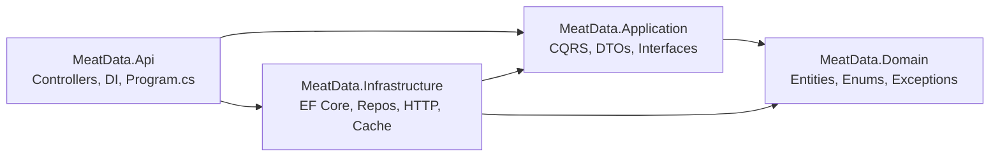
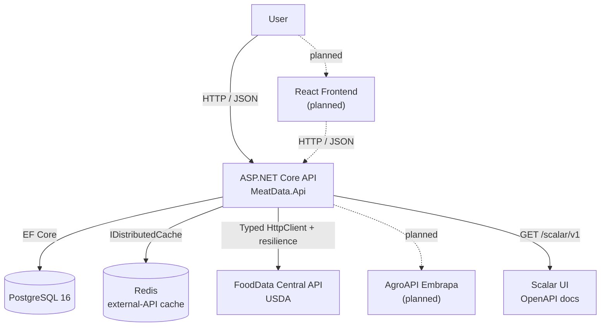
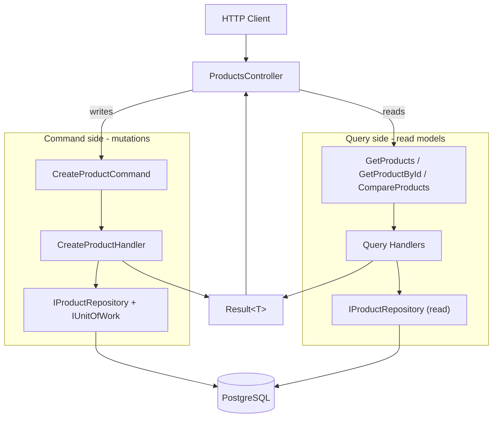
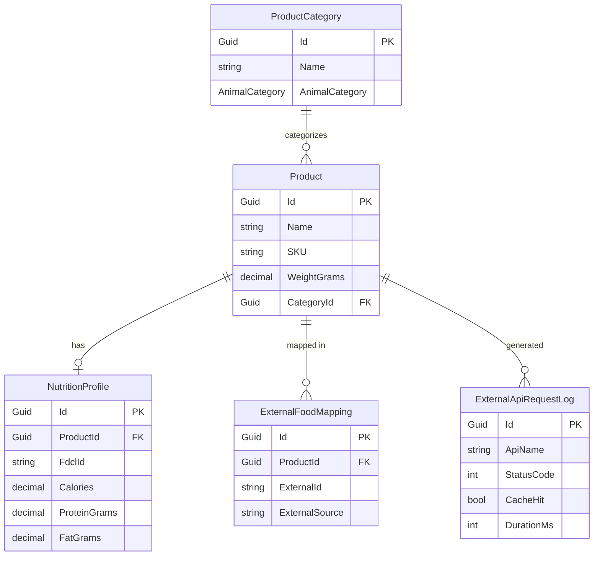
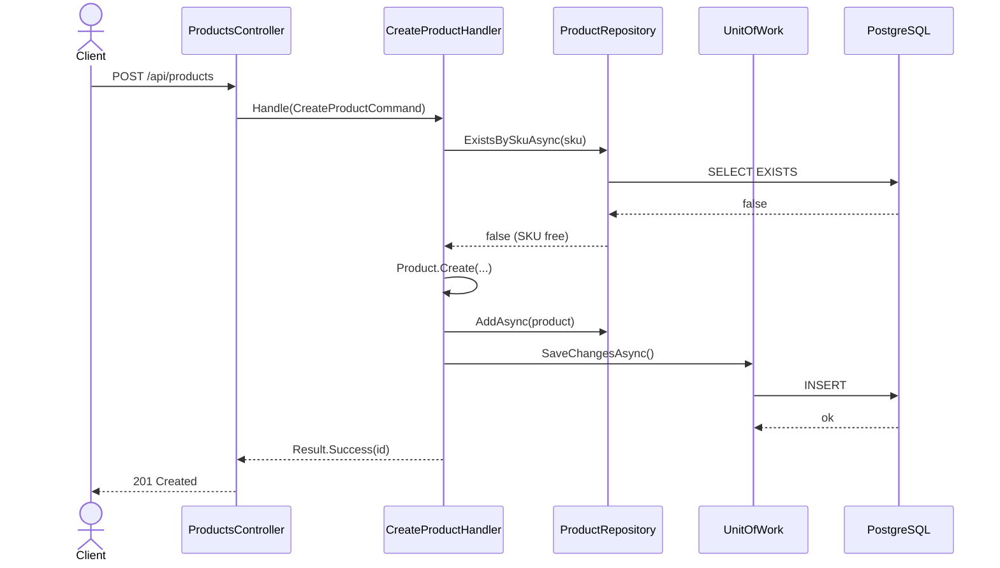

# MeatData Portal

> REST API for registering, querying, and comparing meat cuts/products with automatic nutritional enrichment from public APIs (USDA FoodData Central + Embrapa AgroAPI).
> **Project 1 of 4** in the `frigo-dotnet-labs` learning roadmap.


---

## ⚠️ A note before you judge the architecture

**This is a study / portfolio project, and it is deliberately over-engineered.**

A catalog of meat cuts with nutritional data is, at its core, a glorified CRUD. You could ship it in one afternoon with a single controller talking straight to `DbContext`. So why the four projects, the Repository layer on top of EF Core (which is *already* a Unit of Work + repository), the Decorator-based cache, the Result pattern, and full CQRS?

Because **the goal here is to practice and demonstrate the patterns, not to ship the leanest possible app.** This repo is where I deliberately reach for Clean Architecture, CQRS, resilience pipelines, and Testcontainers so that the muscle memory is there when a project *genuinely* needs them. The point is to learn the trade-offs by living with them.

So throughout this README you'll find honest **"is this overkill?"** verdicts next to each pattern. Read them as: *"yes, for an app this size it's overkill — and that's the whole point."* For a real CRUD of this scope, a vertical slice or even a minimal API would be the right call. Here, the overhead buys learning and a code sample that shows depth.

> If you're coming from **Java/Spring Boot**, there's a [translation table](#-spring-boot-equivalences-for-learners) at the bottom mapping every .NET concept here to its Spring equivalent.

---

## Table of Contents

- [Overview](#overview)
- [Tech Stack](#tech-stack)
- [Architecture](#architecture)
- [CQRS — Command Query Responsibility Segregation](#cqrs--command-query-responsibility-segregation)
- [Domain Model](#domain-model)
- [Design Patterns](#design-patterns)
- [Request Flow Example](#request-flow-example)
- [API Endpoints](#api-endpoints)
- [Project Structure](#project-structure)
- [Getting Started](#getting-started)
- [Tests](#tests)
- [Project Status — What's Done vs. Planned](#project-status--whats-done-vs-planned)
- [Roadmap](#roadmap-frigo-dotnet-labs)
- [Spring Boot Equivalences (for learners)](#-spring-boot-equivalences-for-learners)
- [References](#references)

---

## Overview

A full-stack application to register, query, and compare meat cuts/products, enriched with nutritional data pulled automatically from public APIs and cached to respect rate limits.

**What this project demonstrates:**

- Clean REST API in ASP.NET Core with Clean Architecture
- CQRS split into Commands (writes) and Queries (reads)
- Integration with real public APIs (FoodData Central, with AgroAPI planned)
- Distributed caching of external responses with Redis (Cache-Aside via Decorator)
- Resilient HTTP calls (retry + circuit breaker + timeout)
- Strongly-typed configuration with startup validation
- Unit tests today; integration tests with Testcontainers planned

**What it deliberately leaves out** (each lands in a later roadmap project):

- Authentication / authorization → Project 3
- Messaging (RabbitMQ) → Project 3
- API Gateway / service discovery → Project 2
- AI / MCP integration → Project 4

---

## Tech Stack

### Backend — currently in the repo (.NET 10)

| Package | Version | Purpose |
| :------ | :------ | :------ |
| `Npgsql.EntityFrameworkCore.PostgreSQL` | 10.0.2 | ORM + PostgreSQL driver |
| `Microsoft.EntityFrameworkCore` / `.Tools` / `.Design` | 10.0.9 | EF Core + migrations |
| `Microsoft.AspNetCore.OpenApi` | 10.0.9 | OpenAPI document generation |
| `Scalar.AspNetCore` | 2.5.13 | Interactive API docs (Swagger UI replacement) |
| `Microsoft.Extensions.Caching.StackExchangeRedis` | 9.0.0 | Distributed cache (Redis) |
| `Microsoft.Extensions.Http.Resilience` | 9.7.0 | Retry + circuit breaker for `HttpClient` (Polly under the hood) |

### Test stack

| Package | Purpose |
| :------ | :------ |
| `xUnit` | Test framework |
| `NSubstitute` | Mocking |
| `RichardSzalay.MockHttp` | Mocking `HttpClient` responses |
| `coverlet.collector` | Coverage |

### Frontend — planned (not in the repo yet)

React 19 + Vite + TypeScript, TanStack Query, React Router v7, Axios, Tailwind CSS, shadcn/ui.

### Local infrastructure

| Service | Image | Status |
| :------ | :---- | :----- |
| PostgreSQL 16 | `postgres:16-alpine` | ✅ in `docker-compose.yml` |
| Redis 7 | `redis:7-alpine` | ⏳ wired in `Program.cs`, compose service still to be added |

---

## Architecture

Clean Architecture with the dependency rule pointing **inward**: `Domain` knows nobody, `Application` knows only `Domain`, `Infrastructure` and `Api` depend on the inner layers. Swapping PostgreSQL for SQL Server, or EF Core for Dapper, touches only `Infrastructure`.



### System context

Solid arrows are wired today; dashed arrows are planned.



---

## CQRS — Command Query Responsibility Segregation

**CQRS (Command Query Responsibility Segregation)** is the idea of splitting the model that **changes** state (Commands) from the model that **reads** state (Queries), instead of funneling everything through one fat service. Writes and reads have different shapes, different validation, and different performance profiles — so they get different code paths.

In this project the split lives under `MeatData.Application/Products/`:

- **Commands** (mutations): `CreateProductCommand` + `CreateProductHandler`
- **Queries** (reads): `GetProductsQuery`, `GetProductByIdQuery`, `CompareProductsQuery`, each with its own handler returning purpose-built DTOs (`ProductDto`, `ProductSummaryDto`, `ComparisonDto`)

Each handler returns a `Result<T>`, and the controller translates that into the right HTTP status code.



> **Honest scope note:** this is **CQRS the pattern** (separate command/query handlers), **not** CQRS the architecture (separate read/write databases or event sourcing). Same Postgres database backs both sides. Handlers are injected directly into the controller — **no MediatR yet**. If the handler count grows, MediatR is the natural next step to decouple controllers from handlers (it's the closest thing to Spring's `ApplicationEventPublisher` / command bus). And yes — for a CRUD this small, plain service classes would do. See the [note at the top](#️-a-note-before-you-judge-the-architecture).

---

## Domain Model



| Entity | Responsibility |
| :----- | :------------- |
| `Product` | A meat cut/product registered internally. Domain root, with behavior (factory `Create`, invariants) — not an anemic POCO. |
| `ProductCategory` | Groups products by animal type (beef, pork, poultry, derivatives). `AnimalCategory` is an enum. |
| `NutritionProfile` | Nutritional data enriched from FoodData Central. A product has zero or one. |
| `ExternalFoodMapping` | Records which external ID (FDC ID) was mapped to the internal product. |
| `ExternalApiRequestLog` | Log of every external API call — useful for a history screen and debugging. |

---

## Design Patterns

Each pattern below ships in the repo. The verdict column is deliberately blunt about whether it earns its keep at this scale.

| Pattern | Where | Verdict at this scale |
| :------ | :---- | :-------------------- |
| **Clean Architecture** | 4 projects | Overkill for a CRUD; worth it as a portfolio centerpiece and for testability. |
| **CQRS** | `Application/Products/{Commands,Queries}` | The clean win — read and write shapes genuinely differ. |
| **Repository** | `IProductRepository` + `ProductRepository` | Redundant over EF Core (already UoW + repo), but keeps `Application` testable without a DB. |
| **Unit of Work** | `IUnitOfWork` + `UnitOfWork` | Makes the transaction boundary explicit instead of leaking `SaveChangesAsync`. |
| **Options** | `FoodDataCentralOptions` + `ValidateOnStart()` | Pure upside. Config fails at startup, not at 3 a.m. in prod. |
| **Typed HttpClient** | `FoodDataCentralClient` | Correct lifecycle management; avoids socket exhaustion. |
| **Resilience pipeline** | `AddResilienceHandler` (retry, circuit breaker, timeout) | Right call — external APIs *will* throttle and flake. |
| **Result pattern** | `Result<T>` | Verbose, but business errors become explicit in the method contract instead of exceptions. |
| **Decorator (Cache-Aside)** | `CachedFoodDataCentralClient` wraps the real client | Elegant — caching is layered on without polluting the real client. |

---

## Request Flow Example

`POST /api/products` — the implemented write path (Command side of CQRS):



---

## API Endpoints

### Products — implemented (`ProductsController`)

| Method | Route | Description | Status codes |
| :----- | :---- | :---------- | :----------- |
| `GET` | `/api/products` | List products (optional `?categoryId=`) | 200 |
| `GET` | `/api/products/{id}` | Product by ID with nutrition profile | 200, 404 |
| `GET` | `/api/products/compare?ids={id1},{id2}` | Compare products | 200, 400, 404 |
| `POST` | `/api/products` | Create a product | 201, 400, 409 |
| `DELETE` | `/api/products/{id}` | Delete a product (partial — see note) | 204, 404 |

> `DELETE` currently returns `204` when the product exists but the actual `DeleteProductHandler` is still a `TODO` in the code — a good exercise to wire up following the `Create` pattern.

### Planned endpoints

| Method | Route | Notes |
| :----- | :---- | :---- |
| `PUT` | `/api/products/{id}` | Update product |
| `POST` | `/api/products/{id}/enrich-nutrition` | Fetch + attach FoodData Central data (`EnrichProductNutrition` command) |
| `GET` | `/api/categories`, `POST /api/categories` | `CategoriesController` |
| `GET` | `/api/nutrition/search?q=`, `/api/nutrition/{fdcId}` | `NutritionController` (direct FDC search) |
| `GET` | `/api/request-logs` | `ApiRequestLogsController` (external-call history) |

---

## Project Structure

Reflects what's actually in the repo today (build artifacts omitted):

```text
MeatData Portal/
├── src/
│   ├── MeatData.Domain/
│   │   ├── Entities/            # Product, ProductCategory, NutritionProfile,
│   │   │                        # ExternalFoodMapping, ExternalApiRequestLog
│   │   ├── Enums/               # AnimalCategory
│   │   └── Exception/           # DomainException, ProductNotFoundException
│   │
│   ├── MeatData.Application/
│   │   ├── Common/              # Result<T>
│   │   ├── Interfaces/          # IUnitOfWork, Repositories/, ExternalApis/
│   │   ├── Models/ExternalApis/ # FoodSearchResult, FoodDetail, FoodNutrient
│   │   └── Products/
│   │       ├── Commands/CreateProduct/
│   │       ├── Queries/{GetProducts,GetProductById,CompareProducts}/
│   │       └── DTOs/            # ProductDto, ProductSummaryDto, CategoryDto, NutritionProfileDto
│   │
│   ├── MeatData.Infrastructure/
│   │   ├── Persistence/         # AppDbContext, Configurations/, Repositories/, UnitOfWork
│   │   ├── Migrations/          # InitialCreate, AddNutritionProfileInProduct
│   │   ├── ExternalApis/FoodDataCentral/   # Client + Options
│   │   └── Cache/               # CachedFoodDataCentralClient (Decorator)
│   │
│   └── MeatData.Api/
│       ├── Controllers/         # ProductsController
│       ├── Program.cs           # DI wiring, pipeline
│       └── appsettings*.json
│
├── MeatDataPortal.Tests/        # xUnit + NSubstitute + MockHttp
├── docker-compose.yml           # PostgreSQL 16
├── MeatData.slnx
└── README.md
```

---

## Getting Started

### Prerequisites

- .NET 10 SDK
- Docker + Docker Compose
- A free FoodData Central API key — [api.data.gov/signup](https://api.data.gov/signup)

### 1. Bring up infrastructure

```bash
docker-compose up -d postgres
# Redis service is not in the compose file yet — run one if you want caching to work:
# docker run -d --name meatdata-redis -p 6379:6379 redis:7-alpine
```

### 2. Configure connection strings + API key

Set these via environment variables or `appsettings.Development.json`:

```text
ConnectionStrings__Default=Host=localhost;Port=5432;Database=meatdata;Username=meatdata_user;Password=meatdata_password
ConnectionStrings__Redis=localhost:6379
FoodDataCentral__BaseUrl=https://api.nal.usda.gov/fdc/v1/
FoodDataCentral__ApiKey=YOUR_KEY_HERE
```

### 3. Apply migrations

```bash
dotnet ef database update --project src/MeatData.Infrastructure --startup-project src/MeatData.Api
```

### 4. Run the API

```bash
dotnet run --project src/MeatData.Api
# API:  https://localhost:5001  (or the port in launchSettings.json)
# Docs: /scalar/v1
```

---

## Tests

```bash
dotnet test
```

Today the `MeatDataPortal.Tests` project covers handlers and the external client with **xUnit + NSubstitute + MockHttp**:

- `CreateProductHandlerTests` — command handler logic
- `FoodDataCentralClientTests` — typed HTTP client
- `CachedFoodDataCentralClientTests` — the cache decorator

**Planned:** split into `UnitTests` + `IntegrationTests`, and add end-to-end endpoint tests with `WebApplicationFactory<Program>` + **Testcontainers** (real PostgreSQL + Redis in Docker, no mocked DB). `Program` is already exposed as `public partial class Program` precisely so the integration test host can boot it.

---

## Project Status — What's Done vs. Planned

**Done ✅**

- [x] 4-project Clean Architecture solution (.NET 10)
- [x] Domain: 5 entities + enum + domain exceptions, with behavior on `Product`
- [x] EF Core `AppDbContext`, configurations, 2 migrations
- [x] Repository + Unit of Work
- [x] CQRS: `CreateProduct` command; `GetProducts`, `GetProductById`, `CompareProducts` queries
- [x] `Result<T>` pattern + HTTP translation in the controller
- [x] FoodData Central typed `HttpClient` with retry / circuit breaker / timeout
- [x] Redis Cache-Aside via Decorator (`CachedFoodDataCentralClient`)
- [x] Options pattern with `ValidateOnStart()`
- [x] OpenAPI + Scalar UI
- [x] `ProductsController` (list, get, compare, create, partial delete)
- [x] Unit tests (handler + clients)
- [x] `docker-compose` for PostgreSQL

**Planned ⏳**

- [ ] `EnrichProductNutrition` command + `/enrich-nutrition` endpoint
- [ ] `PUT` update + full `DeleteProductHandler`
- [ ] `Categories`, `Nutrition`, `RequestLogs` controllers + their repositories
- [ ] AgroAPI (Embrapa) client with graceful degradation
- [ ] FluentValidation request validators
- [ ] Serilog structured logging + global exception-handling middleware
- [ ] Add Redis service to `docker-compose`; add `.env.example`
- [ ] React frontend
- [ ] Integration tests with Testcontainers + `WebApplicationFactory`
- [ ] ADR docs under `docs/adr/`
- [ ] (If handler count grows) introduce MediatR

---

## Roadmap (`frigo-dotnet-labs`)

MeatData Portal is **Project 1 of 4**. Each project layers on the concerns the previous one deliberately skipped:

| # | Project | Adds |
| :- | :------ | :--- |
| **1** | **MeatData Portal** *(this repo)* | Clean Architecture, CQRS, external API integration, caching, resilience |
| 2 | — | API Gateway (YARP), service discovery (.NET Aspire) |
| 3 | — | Identity / auth, messaging (RabbitMQ), full observability (OpenTelemetry + Grafana) |
| 4 | — | AI / MCP integration, pgvector |

---

## 🌱 Spring Boot Equivalences (for learners)

Coming from the JVM? Here's the Rosetta Stone for everything in this repo. (The code itself is already sprinkled with these comparisons in the comments.)

| ASP.NET Core / .NET | Spring Boot equivalent |
| :------------------ | :--------------------- |
| `Program.cs` + `builder.Services` | `@SpringBootApplication` + `@Configuration` |
| `builder.Services.AddScoped<T>()` (DI container) | `@Service` / `@Component` + constructor injection |
| `Scoped` lifetime | `@RequestScope` (per-request bean) |
| `[ApiController]` : `ControllerBase` | `@RestController` |
| `[Route("api/[controller]")]` | `@RequestMapping("/api/...")` |
| `[HttpGet]` / `[HttpPost]` | `@GetMapping` / `@PostMapping` |
| route param (implicit `[FromRoute]`) | `@PathVariable` |
| `[FromBody]` (implicit on POST) | `@RequestBody` |
| `[FromQuery]` | `@RequestParam` |
| EF Core `DbContext` | JPA `EntityManager` |
| `Npgsql.EntityFrameworkCore.PostgreSQL` | Spring Data JPA + Hibernate (Postgres dialect) |
| `IProductRepository` + EF | Spring Data `Repository` |
| `IUnitOfWork` / `SaveChangesAsync()` | `@Transactional` / `EntityManager.flush()` |
| EF migrations | Flyway / Liquibase |
| `IOptions<T>` + `ValidateOnStart()` | `@ConfigurationProperties` + `@Validated` |
| `IDistributedCache` (Redis) | Spring Cache `@Cacheable` (Redis) |
| Decorator for caching | `@Cacheable` AOP proxy |
| `AddHttpClient<T>()` (typed client) | `@FeignClient` / `RestClient` |
| `Microsoft.Extensions.Http.Resilience` | Resilience4j |
| `Result<T>` (business errors) | Vavr `Either` / result objects |
| direct handler injection (no MediatR) | service classes; MediatR ≈ a command bus / `ApplicationEventPublisher` |
| OpenAPI + Scalar | springdoc-openapi (Swagger UI) |
| Serilog *(planned)* | SLF4J + Logback |
| xUnit | JUnit 5 |
| NSubstitute | Mockito |
| `WebApplicationFactory<Program>` *(planned)* | `@SpringBootTest` + MockMvc / `TestRestTemplate` |
| Testcontainers for .NET *(planned)* | Testcontainers (Java) |

---

## References

- [FoodData Central API Guide](https://fdc.nal.usda.gov/api-guide) · [Get an API key](https://api.data.gov/signup)
- [AgroAPI Embrapa Store](https://www.agroapi.cnptia.embrapa.br/store/)
- [ASP.NET Core Minimal APIs](https://learn.microsoft.com/en-us/aspnet/core/fundamentals/minimal-apis)
- [EF Core + PostgreSQL (Npgsql)](https://www.npgsql.org/efcore/)
- [Microsoft.Extensions.Http.Resilience](https://learn.microsoft.com/en-us/dotnet/core/resilience/http-resilience)
- [Options pattern in .NET](https://learn.microsoft.com/en-us/dotnet/core/extensions/options)
- [Scalar + ASP.NET Core OpenAPI](https://scalar.com/blog/scalar-dotnet)
- [Testcontainers for .NET](https://dotnet.testcontainers.org/)
- [Clean Architecture — Jason Taylor template](https://github.com/jasontaylordev/CleanArchitecture)
